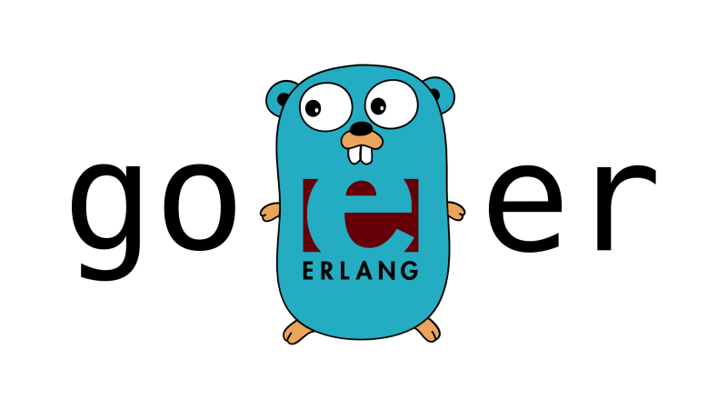

# `goer`: A minimal Erlang implemented in Go



`goer` is a simple language inspired by [Erlang](erlang-book). It implements a subset of Erlang's features with
some modifications. I wrote it as a project intended to understand better the concepts behind Erlang, but also
to compare the differences in the approach to concurrency in Erlang vs Go.
Both [Erlang's](erlang-concurrency) and [Go's](go-concurrency) treat it as message passing.
While the two languages are very different, and Go was designed over twenty years after Erlang, you can find many
parallels in how they treat concurrency. By implementing Erlang in Go, I wanted to have a better feeling of how
far-reaching are the similarities. Moreover, in the past, I [implemented Scheme several times], this time, I wanted
to create a parser for a language that has a syntax. Another inspiration for this was Rob Pike's
[talk about implementing lexers in Go].

`goer` is a toy language, with a very basic set of functionalities. It doesn't even implement
any other numerical types than integers. The set of features is minimal by design, whatever can be implemented
using `goer`s primitives, would not be implemented as a part of the language itself. For example, strings
have very limited support, if you want to manipulate them, use `split` to transform them into lists of character-string
values.

## Features

* The language uses Erlang-like syntax, the syntax coloring for Erlang would mostly work for it out-of-the-box.
* As in Erlang, everything is immutable.
* There's extensive support for pattern matching.
* The language is [tail-call optimized] and looping is done by making recursive function calls.
* It has basic data types like atoms, booleans, integers, strings, lists, and tuples.
* It has a REPL.

## Differences from Erlang

* It is a small subset of the Erlang language.
* It is interpreted, not compiled.
* Names of some functions (e.g. it has `print`) or the operators (e.g. `!=` instead of `/=`) differ.
* Erlang has two different syntaxes for defining anonymous and named functions. In `goer` functions are only defined
  using `fun` keywords (see [below](#Functions)).
* Erlang relies on linked lists, while `goer` uses [Go slices] instead, this forces using different programming patterns.
* There are also some small differences, like `_ = _` not raising an error.
* You wouldn't be able to use it to build a distributed system running on multiple machines, as you would with Erlang.

## Language tour

Expressions that are evaluated need to be finished with `.`, as in Erlang. They can consist of multiple sub-expressions,
in such a case, they would be separated with `,`.

### Data types

* Atoms are data types defined only by their names. The names are written as words starting with a lowercase letter
  and can have letters, numbers, `_` and `@` in their names. Examples are `foo`, `other_@Atom`, etc.
* Booleans: `true` and `false`, are special kinds of atoms. There are basic boolean operations like `not`, `and`,
  and `or`[^1] that can be applied to booleans.
* Integers map to Go's `int` type, so are at least 32-bit signed integers. Arithmetic operations `+`, `-`, `*`, `/`
  (integer division), and `rem` (reminder) can be used with integers. They can also be compared with `<`, `<=`[^2],
  `>`, `>=`, and the standard `==` and `!=`[^3].
* Strings are surrounded by double quotes, like `"Hello, World!"`. They respect the [same escape characters as Go does],
  so `"\"Hello,\nWorld!\""` is a string that has double quotes and a newline. You can use `str` to convert an arbitrary
  value to a string (including functions). With `split` string can be converted to a list of single-character strings,
  this may be used for string manipulation. Strings can be concatenated with the `++` operator.
* Tuples like `{foo, bar, 1, "hi", {}, false}` can contain values of other data types. They can be accessed by
  [pattern-matching](#pattern-matching) their content.
* Lists of other values `[1, 2, [foo, {3, 4}], "bar"]`. Lists can be concatenated with `++`. They can be cheaply
  reversed with `rev(Lst)`. Their size can be checked with `len(Lst)`. Their last value can be accessed with `last(Lst)`
  and list containing all the values but last with `rest(Lst)`. Additionally, `nth(Lst, Idx)` allows for accessing
  the value at the `Idx` position (zero-indexed) of the list `Lst`.

There are `is_atom`, `is_bool`, `is_int`, `is_str`, `is_list`, and `is_tuple` functions to check if a value belongs to
a specific type.

Functions can have lowercase names as well, so `print("hi")` is a function with the `"hi"` argument, not an atom.

The operations in `goer`, like the arithmetic ones, are evaluated left-to-right but follow the standard rules of
precedence, and the [precedence] is consistent with Erlang.

### Lists are slightly different

Erlang, the same as lisps, and functional languages like OCaml or Haskell, extensively use linked lists. Many of
the programming patterns in it evolved from this dependency. [Linked lists] however are in practice less efficient
than in theory, and have better modern alternatives. `goer` uses [Go slices] instead, which leads to different
programming patterns.

In Erlang, the [recommended way](erlang-lists) to add an element to a list is by using the cons operator
`[Elem | List]` (which has *O(1)* complexity). The syntax is not available in `goer`. Since underneath `goer`'s lists
are [Go slices], the cheaper way is to append the new element at the back of the slice. For this reason, `goer` rather
uses the `++` operator, which in Erlang is mostly used to combine lists, e.g. `[1,2] ++ [3,4] == [1,2,3,4]`.
In `goer`, to add an element to the list, you would use `List ++ Elem` which adds the element at the back of the list.
The `++` operator is overloaded, `[foo] ++ bar` is interpreted the same as `[foo] ++ [bar]`.

For the same reason as above, head and tail functions are not as useful for dealing with lists as in Erlang.
Instead, there are `last` and `rest` for accessing the last and everything but the last value.

This leads to different patterns, for example, to reverse a list in Erlang you [could use a recursive function]:

```erlang
reverse(Lst) -> reverse(Lst,[]).
reverse([], Acc) -> Acc;
reverse([Head|Tail], Acc) -> reverse(Tail, [Head|Acc]).
```

in `goer` the same function would work in reverse (pun intended):

```erlang
fun reverse
    (Lst) -> reverse(Lst, []);
    ([], Acc) -> Acc;
    (Lst, Acc) -> reverse(rest(Lst), Acc ++ last(Lst))
end.
```

### Everything is immutable

As with every other language, `goer` has variables. Their names need to start with uppercase letters. The same as with
Erlang, the variables however are [immutable].

```erlang
X = 1.
X = 8.    % ERROR: 'X' and '8' do not match
X = X+1.  % ERROR: 'X' and '2' do not match
2+5 = Y.  % also works
```

This prevents [race conditions] and promotes [*communicating by message passing, not sharing memory*][go-proverb].

### Pattern matching

Many functional languages heavily use pattern matching. The same applies to Erlang and `goer`. As shown above,
assigning a value to the variable is done using the ["match" operator] `=`. `X = 1` means
"match `X` against `1`", if `X` didn't have any value before, it now is equivalent to `1`. The next attempt to match
it with a different value would fail with an error. Pattern matching can also be used to access the values of tuples:

```erlang
{First, 2, Third} = {1, 2, 3}.
First = 1.  % ok
Third = 3.  % ok
```

There is also the wildcard character `_` which matches anything. For example, we could match elements of a four-element
list to extract a specific one:

```erlang
[_, _, X, _] = [foo, bar, baz, qux].
X = baz.  % ok
```

(The Erlang's `[Head | Tail]` matching is not implemented.)

### Control flow

`goer` has the standard Erlang's `if` statement, which can consist of multiple conditional blocks
(so it is more like [`cond` in Scheme], than `if` in other languages).

```erlang
if
    Cond1 ->
        Body1;
    ...;
    CondN ->
        BodyN
end
```

The conditions `Cond1` ... `CondN` need to evaluate to booleans. For example,

```erlang
if
    X > 5 -> yes;
    _ -> no
end
```

It also has the `case` statement:

```erlang
case Expr of
    Pattern1 [when Guard1] ->
        Body1;
    ...;
    PatternN [when GuardN] ->
        BodyN
end
```

For example, [FizzBuzz] written using the case statement would be:

```erlang
fun fizzbuzz (X) ->
    case { X rem 3, X rem 5 } of
        {0, 0} -> fizz_buzz;
        {0, _} -> fizz;
        {_, 0} -> buzz;
        _ -> X
    end
end
```

We could use the `case` with the guard (after `when`) to check if a value is larger than 5 in an
overengineered way:

```erlang
case 10 of
    X when X > 5 -> yes;
    _ -> no
end
```

Unlike Erlang, there are no restrictions on guard statements other than that they need to evaluate to booleans.

Both `if` and `case` would throw an error when no branch matches the conditions.

Instead of Erlang's `try ... catch ... end`, there is a much simpler `try ... recover ... end` statement. It evaluates
the expression in the `try` block and in case of an error, and only if, it executes the expression in the
`recover` block. It is not possible to catch specific errors. Neither of the blocks can be empty.

```erlang
try
    Body1
recover
    Body2
end
```

### Functions

Erlang has two ways of defining the functions. It allows for either anonymous functions

```erlang
fun(X) -> X + 10 end
```

or named functions

```erlang
fact(0) -> 1;
fact(N) when N > 0 ->
    N * fact(N-1).
```

`goer` combines both syntaxes. The anonymous functions are written the same way, but named functions are written
like the anonymous ones, but with the (atom-like) name after the `fun` keyword. This syntax is similar to
[OCaml's `function`]. The `fact` function from above in `goer` would be

```erlang
fun fact
    (0) -> 1;
    (N) when N > 0 ->
        N * fact(N-1)
end
```

Every function, build-in or user-defined, needs to return something. Side-effects-only functions are not possible.
When it is not possible to return anything, some functions would throw an error, for example, `last([])` would fail,
because an empty list does not have the last value.

### Concurrency and message passing

As in Erlang, it is super-easy to start a concurrent process (in `goer`, there's a [goroutine] underneath!) with the
`spawn` function. In the example below, it would concurrently print "hi!", which is a completely pointless thing to do.
The `spawn` function returns the process ID (`Pid` below) of the process. The process ID of the current process
can be obtained by calling `self()`.

```erlang
Pid = spawn(fun() -> print("hi!") end).
```

The process ID can be used to send messages and to communicate with the other processes. The `!` operator means
send `Msg` message to the process identified by `Pid`. Sending a message to a process that is not alive anymore
would have no effect and no error would be shown as well, the same as in Erlang.

```erlang
Pid ! Msg
```

The messages can and need to be received. For this, we use the `receive` block that pattern-matches the messages.
If a message that does not match the pattern is received, it is silently dropped. It is possible to specify a timeout
so that after a specific time the `after` block gets evaluated.

```erlang
receive
    Pattern1 [when Guard1] -> Body1;
    ...;
    PatternN [when GuardN] -> BodyN;
after
    Expr -> BodyM
end
```

In Erlang, you could use the `is_process_alive` function to check if the process is still alive. There is [no nice way]
of checking if a goroutine is alive, so such a function is not implemented. It can be done by implementing the
processes in such a way that they would respond to a healthcheck query, for example:

```erlang
fun loop()->
    receive
        {Sender, ping} ->
            Sender ! {self(), pong},
            loop()
    end
end,

Pid = spawn(loop),
Pid ! {self(), ping},
receive
    {Pid, pong} -> ok
after
    100 -> timeout
end.
```

It is also [not possible] to kill the goroutine from the "outside", so there's no `exit/2` function in `goer` to
do this. It could be implemented in a similar way as above, where the process would terminate itself after receiving
the "terminate" message. It is similar to the `link` function, which makes the linked processes in Erlang [die together].
Linking could be implemented in `goer` by the linked processes keeping the list of linked processes and on exit
(you could use `try ... recover ... end` here) they would send the "terminate" signal to the other processes.

## Grammar

`goer`'s grammar in [EBNF] form is:

```c
Dummy           = '_'
Atom            = ( 'a'..'z' ) [ 'a'..'z' | 'A'..'Z' | '0'..'9' | '_' | '@' ]*
Variable        = ( 'A'..'Z' ) [ 'a'..'z' | 'A'..'Z' | '0'..'9' | '_' | '@' ]*
Bool            = 'true' | 'false'
Int             = ( '0'..'9' )*
String          = '"' ( Any - '\"' )* '"'
Tuple           = '{' Exprs '}'
List            = '[' Exprs ']'
Bracket         = '(' Expr ')'
Term            = Atom | Bool | Int | String | Tuple | List
Expr            = Term | Variable | Dummy | Bracket | UnaryOperation | BinaryOperation | Call | Fun
Exprs           = Expr [ ',' Expr ]*
Block           = Exprs '.'
Op              = '+' | '-' | '*' | '/' | 'rem' | '==' | '!=' | '<' | '<=' | '>' | '>=' | '=' | '!' | 'and' | 'or'
UnaryOperation  = ( '+' | '-' | 'not' ) Expr
BinaryOperation = Expr Op Expr
Call            = ( Atom | Variable | Bracket ) '(' Exprs ')'
Guard           = 'where' Exprs
FunBranch       = '(' Exprs ')' [ Guard ] '->' Exprs
Fun             = 'fun' [ Atom ] FunBranch [ ';' FunBranch ]* 'end'
IfBranch        = Expr '->' Exprs
If              = 'if' IfBranch [ ';' IfBranch ]* 'end'
CondBranch      = Expr [ Guard ] '->' Exprs
Case            = 'case' Expr 'of' CondBranch [ ';' CondBranch ]* 'end'
Receive         = 'receive' CondBranch [ ';' CondBranch ]* 'after' IfBranch 'end'
Try             = 'try' Exprs 'recover' Exprs 'end'
```

 [^1]: They are short-circuited operators like `andalso` and `orelse` in Erlang.
 [^2]: Erlang uses `=<`, but `<=` seems to be more prevalent in other languages.
 [^3]: Erlang uses `/=`, similar, `!=` seems to be more common.

 [erlang-book]: https://learnyousomeerlang.com/contents
 [Linked lists]: https://www.youtube.com/watch?v=YQs6IC-vgmo
 [erlang-lists]: https://learnyousomeerlang.com/starting-out-for-real#lists
 [Go slices]: https://go.dev/blog/slices-intro
 [talk about implementing lexers in Go]: https://www.youtube.com/watch?v=HxaD_trXwRE
 [EBNF]: https://en.wikipedia.org/wiki/Extended_Backus%E2%80%93Naur_form
 [processes]: https://www.erlang.org/doc/reference_manual/processes
 [go-proverb]: https://www.youtube.com/watch?v=PAAkCSZUG1c&t=168s
 [goroutine]: https://www.youtube.com/watch?v=oV9rvDllKEg
 [go-pipelines]: https://tip.golang.org/blog/pipelines
 [go-share-memory]: https://go.dev/blog/codelab-share
 [erlang-concurrency]: https://learnyousomeerlang.com/the-hitchhikers-guide-to-concurrency
 [implemented scheme several times]: https://twolodzko.github.io/posts/implementing-lisps.html
 [no good way]: https://stackoverflow.com/questions/16105325/how-to-check-a-channel-is-closed-or-not-without-reading-it
 [could use a recursive function]: https://stackoverflow.com/a/22300045/3986320
 [immutable]: https://twolodzko.github.io/posts/hot-potato.html
 [race conditions]: https://stackoverflow.com/q/34510/3986320
 ["match" operator]: https://www.erlang.org/doc/reference_manual/patterns
 [FizzBuzz]: https://rosettacode.org/wiki/FizzBuzz
 [no nice way]: https://stackoverflow.com/q/16105325/3986320
 [not possible]: https://stackoverflow.com/q/42560109/3986320
 [die together]: https://learnyousomeerlang.com/errors-and-processes
 [precedence]: https://www.erlang.org/doc/reference_manual/expressions#operator-precedence
 [`cond` in Scheme]: https://conservatory.scheme.org/schemers/Documents/Standards/R5RS/HTML/r5rs-Z-H-7.html#%_sec_4.2.1
 [tail-call optimized]: https://github.com/kanaka/mal/blob/master/process/guide.md#step-5-tail-call-optimization
 [same escape characters as Go does]: https://pkg.go.dev/strconv#Unquote
 [OCaml's `function`]: https://dev.realworldocaml.org/variables-and-functions.html#declaring-functions-with-function
